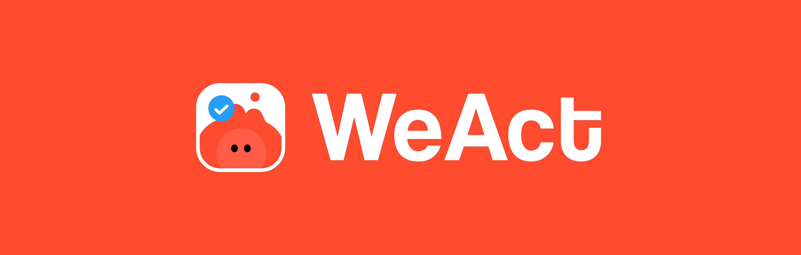
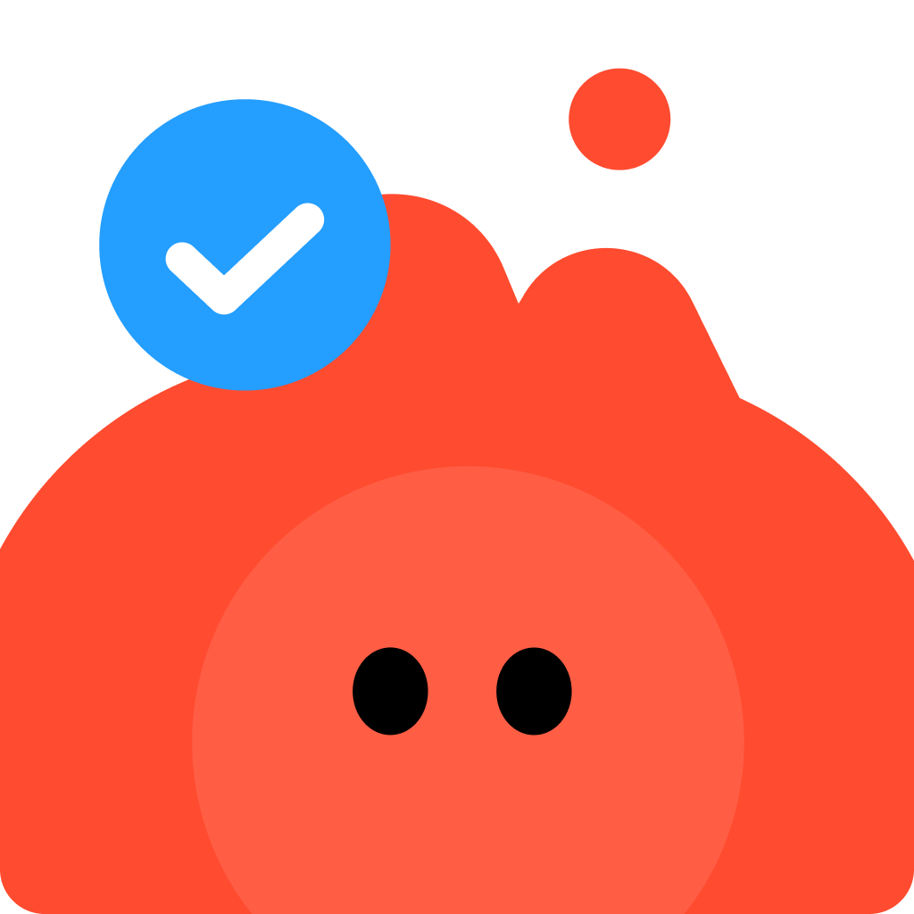
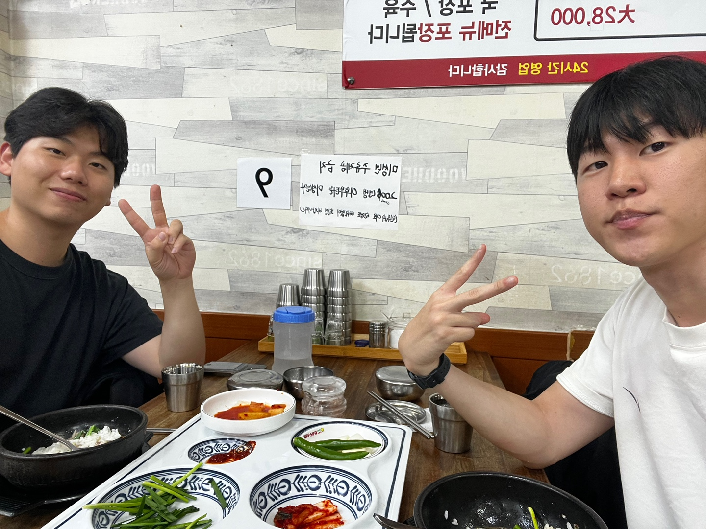
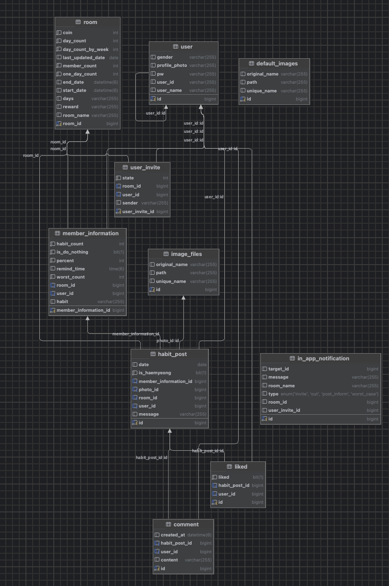

# WeAct - 습관 실천 플랫폼

**WeAct**는 좋은 습관을 만들고, 기록하고, 공유하는 사람들을 위한 실천 기반 SNS 플랫폼입니다.  
혼자서 하기 어려운 습관을 친구와 함께 인증하며, 재미와 책임감을 통해 꾸준히 실천할 수 있도록 도와줍니다.

  

---

## 📌 주제

### 🎯 주제: 함께 실천하는 습관 플랫폼, WeAct

- WeAct는 혼자 하면 쉽게 포기하는 습관을 **‘함께’** 실천하게 만들어주는 플랫폼입니다.
- 단순한 기록형 습관 앱이 아닌, **사진 인증, 해명 기능, 그룹 보드, 랭킹 시스템** 등을 통해  
  재미와 심리적 유대감을 기반으로 습관의 지속성을 높입니다.

---

## 📌 자기소개 및 역할 분담

  

> ERD 설계는 두 사람이 함께 진행하였습니다.

| 이름     | 주요 담당 기능                                                                                                                                  |
|---------|-------------------------------------------------------------------------------------------------------------------------------------------|
| 🔥빈지성 | - JWT 로그인 기능 - 피드 기능 전체 (게시글, 이미지, 좋아요, 댓글) - AWS S3 파일 업로드                                                                         |
| 🥷김종언 | - 인앱 알림 시스템: 인증, 초대, 해명 등 이벤트 기반 실시간 전송 - 그룹 초대장 생성 및 수락/거절 처리 기능 - 중간/최종 랭킹 로직: 인증률 기반 정렬 및 점수화 처리 - 일정 기간 미인증 시 자동 강제 퇴장 로직 구현 |

---

## 🛠 사용 기술 스택

### 협업 도구
- Figma
- Notion
- Slack
- Git / GitHub

### 백엔드
- Java 17
- Spring Boot
- Spring Security
- JPA (Hibernate)
- MySQL
- AWS (EC2, RDS)

---

## 🚀 주요 기능 소개

### 1️⃣ JWT 기반 로그인 시스템
- 토큰 기반 인증을 통해 로그인 후 사용자 정보를 안전하게 유지합니다.
- 매 요청마다 사용자 데이터를 넘기지 않아도 서비스 전반에서 인증된 유저로 작동합니다.

### 2️⃣ 그룹 생성
- 그룹 이름, 기간, 인증 주기 등 설정을 통해 습관 실천 그룹을 생성합니다.
- 친구 검색 후 초대할 수 있으며, 생성된 그룹은 홈 화면에서 관리할 수 있습니다.

### 3️⃣ 친구 초대
- 그룹 생성 시 초대장이 발송되며, 인앱 알림을 통해 수락 또는 거절할 수 있습니다.
- 수락 시 해당 친구는 그룹 멤버로 자동 추가됩니다.

### 4️⃣ 그룹 멤버 관리
- 그룹 내 각 멤버의 습관, 리마인드 시간, 달성률 등을 확인하고 관리할 수 있습니다.
- 이를 바탕으로 중간 랭킹 및 최종 결과도 산출됩니다.

### 5️⃣ 습관 인증 피드
- 사용자는 하루 습관을 이미지와 메시지로 인증할 수 있습니다.
- 좋아요 및 댓글 기능을 통해 그룹원 간의 응원과 소통이 가능합니다.

### 6️⃣ 해명 기능
- 실천이 어려운 날에는 해명 기능을 통해 텍스트 또는 이미지로 사유를 남길 수 있습니다.
- 이를 통해 부담 없이 꾸준함을 이어갈 수 있습니다.

### 7️⃣ 랭킹 및 보상 시스템
- 그룹 내 인증 현황을 기반으로 중간/최종 랭킹을 제공합니다.
- 전체 인증 완료 시 캐릭터 보상이 주어져 공동 성취감을 높입니다.

---

## 📄 API 명세서

- [롱커톤 API 명세서 (빈지성)](https://www.notion.so/API-22710239f1ad803bafbce2784cf7de95?pvs=21)
- [롱커톤 API 명세서 (김종언)](https://www.notion.so/API-225847b31a0f80d89216d37d07a85039?pvs=21)

---

## 🧩 ERD

---

